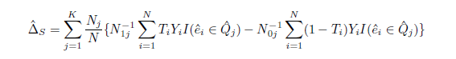

```{r setup, include=FALSE}
knitr::opts_chunk$set(echo = TRUE)
```

## Setup

First, we set working directories as needed, install required libraries and import the data. 

```{r wd, warning = FALSE, message = FALSE, echo = FALSE}
#setwd("~/GitHub/Fall2020-Project4-group-4/doc")
```

```{r, warning = FALSE, message = FALSE, echo = FALSE}
packages.used <- c("dplyr", "ggplot2", "WeightedROC", "rpart", "rpart.plot")

# check packages that need to be installed.
packages.needed <- setdiff(packages.used, intersect(installed.packages()[,1], packages.used))

# install additional packages
if(length(packages.needed) > 0){
   install.packages(packages.needed, dependencies = TRUE)
}

library(dplyr)
library(ggplot2)
library(WeightedROC)
library(rpart)
library(rpart.plot)
library(base)
```

```{r}
df_high <- read.csv("../data/highDim_dataset.csv")
df_low <- read.csv("../data/lowDim_dataset.csv")
```

## Introduction 
In this project, we are looking for the best algorithm for causal inference of propensity scores to see how close the estimated ATEs are to the true ATEs. For the estimation of propensity scores, we use regression trees. The algorithms we use to compare ATE in this project are Stratification, Regression Adjustment and a combination of those two algorithms. We also compare the run times of different algorithms across both data sets.


## About the Data
There are two attached data sets for this project, named *highDim_data set* and *lowDim_data set*. For high dimension data, there are 2000 observations, 185 variables ($V1$-$V185$), 1 treatment indicator ($A$) and 1 response variable ($Y$) . For low dimension data, there are 475 observations, 22 variables ($V1$-$V22$), 1 treatment indicator ($A$) and 1 response variable ($Y$).


```{r, echo = FALSE}
# justification for using weights
print("High Dimensional Data")
prop.table(table(df_high$A))

print("Low Dimensional Data")
prop.table(table(df_low$A))
```

From the table above, we see that the control groups are not balanced for both data sets. So for the purpose of comparing the different algorithms we chose to add weights to the observations while estimating the propensity scores using classification/regression trees.

## Background 

### Classification/Regression Trees
The mathematical formula for regression/classification tree is shown below.

$\hat{f}(x) = \sum_{m = 1}^{M} c_{m}I\{x \in R_{m}\}$
Here, $M$ is the number of regions, $R_m$is a specific region and $c$ is the value associated with a region. 

The way regression trees work is that the space is split into multiple regions based on some decisions. This process keeps repeating until a stopping rule is applied. In regression, we use square error loss to find the optimal tree model, but in classification, as with the case for estimating propensity scores, we use a measure of impurity. In our case, we use one called the Gini Index. In R, we use a library called "rpart" to run the tree algorithm. The function allows users the choice to choose several hyperparameters, of which is called "cp" indicating the complexity of the model. This is a method of pruning the tree and allows the algorithm to determine if a split is worth pursuing. That is, we get more complex trees with lower values of "cp". 

The advantages of using a tree are interpretability and automated variable selection. It is easy to interpret because we can just see the tree and the decision rules at each split that help us understand how the algorithm is making the decisions at each step.


### Propensity Scores

$e(x) = Pr(T = 1 | X = x), ~ 0 < e(x) < 1$

Based on the formula above, given the covariates, propensity score is the probability that the observation is in the treatment group (in our case, observations where A = 1). Since, our data is based on observational studies, we can use propensity scores to make causal inferences. 

### Average Treatment Estimation

$\Delta_{t} = E(Y_{1} - Y_{0} | T = 1)$
ATE is defined as the difference in the average outcomes between observations assigned to treatment group and the control group.

## Cross-Validation
We perform a 5 fold cross-validation for the high dimension and low dimension data sets. The main objective of the cross validation is to tune the "cp" parameter to avoid overfitting.

### Step 1: Set Controls and Establish Hyperparameters
We set up the controls to start the the cross validation process

```{r}
K <- 5  # number of CV folds
sample.reweight <- TRUE # run sample reweighting in model training

# setting the following to false loads data generated from a previous run
# this data is the same in each run due to a set seed

run.cv.trees_high <- FALSE # run cross-validation on the training set for trees on high dim data

run.cv.trees_low <- FALSE # run cross-validation on the training set for trees on low dim data
```

We choose a set of "cp" values here to cross validate in order to find the optimal "cp" value for each data set.


```{r}
# hyperparameters for trees
hyper_grid_trees <- expand.grid(
  cp = c(2^(0), 2^(-1), 2^(-2), 2^(-3), 2^(-4), 
         2^(-5), 2^(-6), 2^(-7), 2^(-8), 2^(-9), 
         2^(-10), 2^(-11), 2^(-12), 2^(-13), 2^(-14), 
         2^(-15), 2^(-16), 2^(-17), 0, -2^(0))
)
```

### Step 2: Cross-Validate the Hyperparameters

We source the library functions that we created to help cross validate the hyperparamter.


```{r loadlib_trees, echo=FALSE}
source("../lib/train_trees.R") 
source("../lib/test_trees.R")
source("../lib/cross_validation_trees.R")
```


```{r features}
# features are the predictors: V1 - Vp
# column 1 is the response Y
# column 2 is the treatment A

feature_train_high = df_high[, -1:-2]
label_train_high = df_high[, 2]

feature_train_low = df_low[, -1:-2]
label_train_low = df_low[, 2]
```

#### High Dimensional Data

We run the cross validation algorithm on the high dimensional data.

```{r runcv_trees_high, message = FALSE, }
set.seed(5243)

if(run.cv.trees_high){
  res_cv_trees_high <- matrix(0, nrow = nrow(hyper_grid_trees), ncol = 4)
  for(i in 1:nrow(hyper_grid_trees)){
    cat("complexity = ", hyper_grid_trees$cp[i], "\n", sep = "")
    res_cv_trees_high[i,] <- cv.function(features = feature_train_high, 
                                         labels = label_train_high,
                                         cp = hyper_grid_trees$cp[i], 
                                         K, reweight = sample.reweight)
  save(res_cv_trees_high, file = "../output/res_cv_trees_high.RData")
  }
} else{
  load("../output/res_cv_trees_high.RData")
}
```

#### Low Dimensional Data

We run the cross validation algorithm on the high dimensional data.

```{r runcv_trees_low, message = FALSE}
set.seed(5243)

if(run.cv.trees_low){
  res_cv_trees_low <- matrix(0, nrow = nrow(hyper_grid_trees), ncol = 4)
  for(i in 1:nrow(hyper_grid_trees)){
    cat("complexity = ", hyper_grid_trees$cp[i], "\n", sep = "")
    res_cv_trees_low[i,] <- cv.function(features = feature_train_low, 
                                        labels = label_train_low, 
                                        cp = hyper_grid_trees$cp[i], 
                                        K, reweight = sample.reweight)
  save(res_cv_trees_low, file="../output/res_cv_trees_low.RData")
  }
}else{
  load("../output/res_cv_trees_low.RData")
}
```

### Step 3: Visualize CV Error and AUC

After cross validating, we obtain the mean error and the AUC values for each potential "cp" value for both data sets. We display these values and standard errors in the plots below. 


#### High Dimensional Data 
Based on the plots and table below, we use the mean AUC value to select the "cp" value of $2^{-7}$.

```{r}
# create data frame to organize results
res_cv_trees_high <- as.data.frame(res_cv_trees_high) 
colnames(res_cv_trees_high) <- c("mean_error", "sd_error", "mean_AUC", "sd_AUC")
cv_results_trees_high = data.frame(hyper_grid_trees, res_cv_trees_high)

# look at top 5 models with highest AUC
cv_results_trees_high[order(cv_results_trees_high$mean_AUC, decreasing = TRUE), ][1:5, ]
```

```{r, out.width = "85%", fig.align = 'center', echo=FALSE}
# round hyperparameter values
cp_2 <- signif(hyper_grid_trees$cp, 3)


# cross validation results for high dimensional data: mean_error 
cv_results_trees_high %>% 
  ggplot(aes(x = as.factor(cp_2), y = mean_error,
            ymin = mean_error - sd_error, 
            ymax = mean_error + sd_error)) + 
  labs(title="Mean of Error with Different cp Values for High Dimensional Data ",
       x="cp", y = "Mean of Error") +
  geom_crossbar() + theme(axis.text.x = element_text(angle = 90, hjust = 1))

# cross validation results for high dimensional data: mean_AUC
cv_results_trees_high %>% 
  ggplot(aes(x = as.factor(cp_2), y = mean_AUC,
             ymin = mean_AUC - sd_AUC, ymax = mean_AUC + sd_AUC)) + 
  labs(title="Mean of AUC with Different cp Values for High Dimensional Data ",
       x="cp", y = "Mean of AUC")+
  geom_crossbar() + theme(axis.text.x = element_text(angle = 90, hjust = 1))
```

```{r}
best_cp_high <- cv_results_trees_high$cp[cv_results_trees_high$mean_AUC ==
                                           max(cv_results_trees_high$mean_AUC)]

best_cp_high
```

#### Low Dimensional Data 

Based on the plots and table below, we use the mean AUC value to select the "cp" value of $2^{-18}$.

```{r}
# create data frame to organize results
res_cv_trees_low <- as.data.frame(res_cv_trees_low) 
colnames(res_cv_trees_low) <- c("mean_error", "sd_error", "mean_AUC", "sd_AUC")
cv_results_trees_low = data.frame(hyper_grid_trees, res_cv_trees_low)

# look at top 5 models with lowest AUC
cv_results_trees_low[order(cv_results_trees_low$mean_AUC, decreasing = TRUE), ][1:5, ]
```

```{r, out.width = "85%", fig.align = 'center', echo=FALSE}
# cross validation results for low dimensional data: mean_error 
cv_results_trees_low %>% 
  ggplot(aes(x = as.factor(cp_2), y = mean_error,
            ymin = mean_error - sd_error, 
            ymax = mean_error + sd_error)) + 
  labs(title="Mean of Error with Different cp Values for Low Dimensional Data ",
       x="cp", y = "Mean of Error")+
  geom_crossbar() + theme(axis.text.x = element_text(angle = 90, hjust = 1))

# cross validation results for low dimensional data: mean_AUC
cv_results_trees_low %>% 
  ggplot(aes(x = as.factor(cp_2), y = mean_AUC,
             ymin = mean_AUC - sd_AUC, ymax = mean_AUC + sd_AUC)) + 
  labs(title="Mean of AUC with Different cp Values for Low Dimensional Data ",
       x="cp", y = "Mean of AUC")+
  geom_crossbar() + theme(axis.text.x = element_text(angle = 90, hjust = 1))
```


```{r}
best_cp_low <- cv_results_trees_low$cp[cv_results_trees_low$mean_AUC ==
                                           max(cv_results_trees_low$mean_AUC)]

best_cp_low
```

## Propensity Score Estimation


```{r weights}
# imbalanced dataset requires weights 
# to be used in the trained model

weights_high <- rep(NA, length(df_high$A))
for (v in unique(df_high$A)){
  weights_high[df_high$A == v] = 0.5 * length(df_high$A) / length(df_high$A[df_high$A == v])
}


weights_low <- rep(NA, length(df_low$A))
for (v in unique(df_low$A)){
  weights_low[df_low$A == v] = 0.5 * length(df_low$A) / length(df_low$A[df_low$A == v])
}
```

#### High Dimensional Data 

```{r}
start.time_propensity_score_high <- Sys.time()

# create tree model for high dimensional data with best cp parameter
tree_high <- rpart(A ~ . - Y, method = "class", data = df_high, cp = best_cp_high)

# calculate propensity scores
prop_score_high <- predict(tree_high, newdata = df_high[, -2], type = "prob")[, 2]

end.time_propensity_score_high <- Sys.time()
time_propensity_score_high <- end.time_propensity_score_high - start.time_propensity_score_high
time_propensity_score_high
```

```{r, out.width = "85%", fig.align = 'center', echo=FALSE}
# plot tree
rpart.plot(tree_high, type = 1, digits = 3, fallen.leaves = TRUE)
```

#### Low Dimensional Data

```{r}
start.time_propensity_score_low <- Sys.time()

# create tree model for low dimensional data with best cp parameter
tree_low <- rpart(A ~ . - Y, method = "class", data = df_low, cp = best_cp_low)

# calculate propensity scores
prop_score_low <- predict(tree_low, newdata = df_low[, -2], type = "prob")[, 2]

end.time_propensity_score_low <- Sys.time()
time_propensity_score_low <- end.time_propensity_score_low - start.time_propensity_score_low
time_propensity_score_low
```

```{r, out.width = "85%", fig.align = 'center', echo=FALSE}
# plot tree
rpart.plot(tree_low, type = 1, digits = 3, fallen.leaves = TRUE)
```

## ATE Estimation

With the estimated propensity scores on hand, we propose, explain, and discuss the pros and cons of three different ATE estimation algorithms: stratification, regression adjustment, and stratification plus regression adjustment together. 

### Stratification

In the stratification method, we are trying to achieve groups where propensity scores hold approximately. For choosing quantiles, the use of quantiles (K=5) was advocated by Rosenbaum and Rubin, however, choosing K=5 will lead to empty stratum for both high and low dimensional data. 
```{r include=FALSE}
K = 5
strata <- seq(0, 1, by = 1/K)
df_high_k5 <- cbind(df_high, prop_score_high)
stratum_values_high <- rep(NA, length(strata))
  
for (i in 1:length(strata)){
  stratum_values_high[i] <- quantile(prop_score_high, strata[i])
}

# values of strata for high data
stratum_values_high

df_high_k5$stratum_class_high <- rep(NA, nrow(df_high_k5))

# assign stratum class to each observation
for (i in 1:nrow(df_high_k5)){
  if ((stratum_values_high[1] <= df_high_k5$prop_score_high[i]) & 
      (df_high_k5$prop_score_high[i] < stratum_values_high[2])) {
    df_high_k5$stratum_class_high[i] <- 1
  } else if ((stratum_values_high[2] <= df_high_k5$prop_score_high[i]) & 
             (df_high_k5$prop_score_high[i] < stratum_values_high[3])) {
    df_high_k5$stratum_class_high[i] <- 2
  } else if ((stratum_values_high[3] <= df_high_k5$prop_score_high[i]) & 
             (df_high_k5$prop_score_high[i] <= stratum_values_high[4])) {
    df_high_k5$stratum_class_high[i] <- 3 
  } else if ((stratum_values_high[4] <= df_high_k5$prop_score_high[i]) & 
             (df_high_k5$prop_score_high[i] <= stratum_values_high[5])) {
    df_high_k5$stratum_class_high[i] <- 4
  } else if ((stratum_values_high[5] <= df_high_k5$prop_score_high[i]) & 
             (df_high_k5$prop_score_high[i] <= stratum_values_high[6])) {
    df_high_k5$stratum_class_high[i] <- 5 
  }
}

summary_high_k5 = expand.grid(
  A = c(0, 1), 
  stratum = seq(1, K, by = 1), 
  n = NA, 
  prop = NA, 
  avg_y = NA
)

for (i in 1:nrow(summary_high_k5)) {
  subset <- df_high_k5[(df_high_k5$A == summary_high_k5$A[i]) & 
                      (df_high_k5$stratum_class_high == summary_high_k5$stratum[i]), ]
  summary_high_k5$n[i] = nrow(subset)
  summary_high_k5$prop[i] = summary_high_k5$n[i]/nrow(df_high_k5)
  summary_high_k5$avg_y[i] = mean(subset$Y)
}


for (i in 1:nrow(summary_high_k5)) {
  if (is.nan(summary_high_k5$avg_y[i]) == TRUE) {
    summary_high_k5$avg_y[i] <- 0 
  }
}
```

```{r include=FALSE}
K = 5
strata <- seq(0, 1, by = 1/K)
df_low_k5 <- cbind(df_low, prop_score_low)
stratum_values_low <- rep(NA, length(strata))
  
for (i in 1:length(strata)){
  stratum_values_low[i] <- quantile(prop_score_low, strata[i])
}

# values of strata for low data
stratum_values_low

df_low_k5$stratum_class_low <- rep(NA, nrow(df_low_k5))

# assign stratum class to each observation
for (i in 1:nrow(df_low_k5)){
  if ((stratum_values_low[1] <= df_low_k5$prop_score_low[i]) & 
      (df_low_k5$prop_score_low[i] < stratum_values_low[2])) {
    df_low_k5$stratum_class_low[i] <- 1
  } else if ((stratum_values_low[2] <= df_low_k5$prop_score_low[i]) & 
             (df_low_k5$prop_score_low[i] < stratum_values_low[3])) {
    df_low_k5$stratum_class_low[i] <- 2
  } else if ((stratum_values_low[3] <= df_low_k5$prop_score_low[i]) & 
             (df_low_k5$prop_score_low[i] <= stratum_values_low[4])) {
    df_low_k5$stratum_class_low[i] <- 3 
  } else if ((stratum_values_low[4] <= df_low_k5$prop_score_low[i]) & 
             (df_low_k5$prop_score_low[i] <= stratum_values_low[5])) {
    df_low_k5$stratum_class_low[i] <- 4
  } else if ((stratum_values_low[5] <= df_low_k5$prop_score_low[i]) & 
             (df_low_k5$prop_score_low[i] <= stratum_values_low[6])) {
    df_low_k5$stratum_class_low[i] <- 5 
  }
}

summary_low_k5 = expand.grid(
  A = c(0, 1), 
  stratum = seq(1, K, by = 1), 
  n = NA, 
  prop = NA, 
  avg_y = NA
)

for (i in 1:nrow(summary_low_k5)) {
  subset <- df_low_k5[(df_low_k5$A == summary_low_k5$A[i]) & 
                      (df_low_k5$stratum_class_low == summary_low_k5$stratum[i]), ]
  summary_low_k5$n[i] = nrow(subset)
  summary_low_k5$prop[i] = summary_low_k5$n[i]/nrow(df_low_k5)
  summary_low_k5$avg_y[i] = mean(subset$Y)
}


for (i in 1:nrow(summary_low_k5)) {
  if (is.nan(summary_low_k5$avg_y[i]) == TRUE) {
    summary_low_k5$avg_y[i] <- 0 
  }
}
```


```{r}
# When K=5, the second stratus of high and low dimensional data are both empty, but we need to make sure each stratum consists at least one object
summary_high_k5
summary_low_k5
```

Therefore we choose K=3 strata , which is the highest value of K that do not produce empty stratum. Then we can estimate ATE between treated and untreated subgroups by following formula:



The advantage of stratification is that it controls systematic differences between the control and treated groups. However, as we mentioned earlier, stratification has balance issues in each stratum, in some extreme cases, some strata may contain subjects from only the treated group or control group, it is impossible to estimate treatment effect. What’s more, Lunceford and Davidian (2004) demonstrated that stratification results in estimates of average treatment effects with greater bias than does a variety of weighted estimators.

```{r}
K = 3
strata <- seq(0, 1, by = 1/K)
```

#### High Dimensional Data 

```{r}
start.time_stratification_high <- Sys.time()

df_high <- cbind(df_high, prop_score_high)
stratum_values_high <- rep(NA, length(strata))
  
for (i in 1:length(strata)){
  stratum_values_high[i] <- quantile(prop_score_high, strata[i])
}

# values of strata for high data
stratum_values_high

df_high$stratum_class_high <- rep(NA, nrow(df_high))

# assign stratum class to each observation
for (i in 1:nrow(df_high)){
  if ((stratum_values_high[1] <= df_high$prop_score_high[i]) & 
      (df_high$prop_score_high[i] < stratum_values_high[2])) {
    df_high$stratum_class_high[i] <- 1
  } else if ((stratum_values_high[2] <= df_high$prop_score_high[i]) & 
             (df_high$prop_score_high[i] < stratum_values_high[3])) {
    df_high$stratum_class_high[i] <- 2
  } else if ((stratum_values_high[3] <= df_high$prop_score_high[i]) & 
             (df_high$prop_score_high[i] <= stratum_values_high[4])) {
    df_high$stratum_class_high[i] <- 3 
  }
}

summary_high = expand.grid(
  A = c(0, 1), 
  stratum = seq(1, K, by = 1), 
  n = NA, 
  prop = NA, 
  avg_y = NA
)

for (i in 1:nrow(summary_high)) {
  subset <- df_high[(df_high$A == summary_high$A[i]) & 
                      (df_high$stratum_class_high == summary_high$stratum[i]), ]
  summary_high$n[i] = nrow(subset)
  summary_high$prop[i] = summary_high$n[i]/nrow(df_high)
  summary_high$avg_y[i] = mean(subset$Y)
}


for (i in 1:nrow(summary_high)) {
  if (is.nan(summary_high$avg_y[i]) == TRUE) {
    summary_high$avg_y[i] <- 0 
  }
}

# this table records the mean response in each stratum; needed for stratification
summary_high

stratum_prop_high <- summary_high %>% group_by(stratum) %>% summarise(sum = sum(n)/nrow(df_high))

# this table records the proportions for each stratum; also needed for stratification
stratum_prop_high

ATE_stratification_high = stratum_prop_high$sum[1]*(summary_high$avg_y[2] - summary_high$avg_y[1]) + 
  stratum_prop_high$sum[2]*(summary_high$avg_y[4] - summary_high$avg_y[3]) + 
  stratum_prop_high$sum[3]*(summary_high$avg_y[6] - summary_high$avg_y[5])

ATE_stratification_high

end.time_stratification_high <- Sys.time()
time_stratification_high <- end.time_stratification_high - start.time_stratification_high
time_stratification_high
```

We find that the ATE for the high dimensional dataset was `r round(ATE_stratification_high, 3)` with a runtime of `r round(time_stratification_high, 3)` seconds. 

#### Low Dimensional Data

```{r}
start.time_stratification_low <- Sys.time()

df_low <- cbind(df_low, prop_score_low)
stratum_values_low <- rep(NA, length(strata))

for (i in 1:length(strata)){
  stratum_values_low[i] <- quantile(prop_score_low, strata[i])
}

# values of strata for low data
stratum_values_low

df_low$stratum_class_low <- rep(NA, nrow(df_low))

# assign stratum class to each observation
for (i in 1:nrow(df_low)){
  if ((stratum_values_low[1] <= df_low$prop_score_low[i]) & 
      (df_low$prop_score_low[i] < stratum_values_low[2])) {
    df_low$stratum_class_low[i] <- 1
  } else if ((stratum_values_low[2] <= df_low$prop_score_low[i]) & 
             (df_low$prop_score_low[i] < stratum_values_low[3])) {
    df_low$stratum_class_low[i] <- 2
  } else if ((stratum_values_low[3] <= df_low$prop_score_low[i]) & 
             (df_low$prop_score_low[i] <= stratum_values_low[4])) {
    df_low$stratum_class_low[i] <- 3 
  } 
}


summary_low = expand.grid(
  A = c(0, 1), 
  stratum = seq(1, K, by = 1),
  n = NA, 
  prop = NA, 
  avg_y = NA
)

for (i in 1:nrow(summary_low)) {
  subset <- df_low[(df_low$A == summary_low$A[i]) & 
                     (df_low$stratum_class_low == summary_low$stratum[i]), ]
  summary_low$n[i] = nrow(subset)
  summary_low$prop[i] = summary_low$n[i]/nrow(df_low)
  summary_low$avg_y[i] = mean(subset$Y)
}


for (i in 1:nrow(summary_low)) {
  if (is.nan(summary_low$avg_y[i]) == TRUE) {
    summary_low$avg_y[i] <- 0 
  }
}

# this table records the mean response in each stratum; needed for stratification
summary_low

stratum_prop_low <- summary_low %>% group_by(stratum) %>% summarise(sum = sum(n)/nrow(df_low))

# this table records the proportions for each stratum; also needed for stratification
stratum_prop_low

ATE_stratification_low = stratum_prop_low$sum[1]*(summary_low$avg_y[2] - summary_low$avg_y[1]) + 
  stratum_prop_low$sum[2]*(summary_low$avg_y[4] - summary_low$avg_y[3]) + 
  stratum_prop_low$sum[3]*(summary_low$avg_y[6] - summary_low$avg_y[5]) 

ATE_stratification_low

end.time_stratification_low <- Sys.time()
time_stratification_low <- end.time_stratification_low - start.time_stratification_low
time_stratification_low
```

We find that the ATE for the low dimensional dataset was `r round(ATE_stratification_low, 3)` with a runtime of `r round(time_stratification_low, 3)` seconds. 

### Regression Adjustment

In this method, we regress the response variable ($Y$) with the treatment variable ($A$) and the propensity scores estimated using our model above, in this case, trees. The estimated coefficient of the treatment variable ($A$) is then an estimate of the ATE. 

D’Agostino (1998) and Austin (2011) compare regression adjustment with more traditional propensity score methods. One of the main advantages of the regression adjustment is in its simplicity in execution, in which one performs a somewhat basic linear regression model on two covariates and one response variable. 

However, depending on the size of the dataset, this may run into computation issues as linear regression involves finding the inverse of a matrix. Additionally, regression adjustment may also not be helpful in cases where there is a strong separation between the two groups. 

No such issues were present in this setup given that both datasets had a relatively small number of observations and there is no clear separation between the two groups, as shown in the residual plots below. 

#### High Dimensional Data 


```{r}
start.time_regression_adjustment_high <- Sys.time()

ps_RA_high <- predict(tree_high, df_high, type = "prob")
high_data_ps <- cbind(ps_RA_high, df_high)
pred_high <- lm(Y ~ A + ps_RA_high, data = high_data_ps)
summary(pred_high)
ATE_regression_adjustment_high = pred_high$coefficients[2]
ATE_regression_adjustment_high

end.time_regression_adjustment_high <- Sys.time()
time_regression_adjustment_high <- end.time_regression_adjustment_high - 
  start.time_regression_adjustment_high
time_regression_adjustment_high
```

```{r, echo = FALSE, out.width = "85%", fig.align = 'center'}
plot(pred_high$residuals, main = "Residual Plot of Regression Adjustment Model - High Dim")
points(which(df_high$A == 1), pred_high$residuals[which(df_high$A == 1)], col = "red")
legend("topright", legend = c("A = 0", "A = 1"), fill = c("black", "red"))
```

We find that the ATE for the high dimensional dataset was `r round(ATE_regression_adjustment_high, 3)` with a runtime of `r round(time_regression_adjustment_high, 3)` seconds. 

#### Low Dimensional Data

```{r}
start.time_regression_adjustment_low <- Sys.time()

ps_RA_low <- predict(tree_low, df_low, type = "prob")
low_data_ps <- cbind(ps_RA_low, df_low)
pred_low <- lm(Y ~ A + ps_RA_low, data = low_data_ps)
summary(pred_low)
ATE_regression_adjustment_low = pred_low$coefficients[2]
ATE_regression_adjustment_low

end.time_regression_adjustment_low <- Sys.time()
time_regression_adjustment_low <- end.time_regression_adjustment_low - 
  start.time_regression_adjustment_low
time_regression_adjustment_low
```

```{r, echo = FALSE, out.width = "85%", fig.align = 'center'}
plot(pred_low$residuals, main = "Residual Plot of Regression Adjustment Model - Low Dim")
points(which(df_low$A == 1), pred_low$residuals[which(df_low$A == 1)], col = "red")
legend("topright", legend = c("A = 0", "A = 1"), fill = c("black", "red"))
```

We find that the ATE for the low dimensional dataset was `r ATE_regression_adjustment_low` with a runtime of `r time_regression_adjustment_low` seconds. 

### Stratification and Regression Adjustment

In this last method, we will combine the first two methods together. In the same way as stratification, we split the datasets into $K = 3$ strata. The choice of $K = 3$ is again because it was the highest value of $K$ that did not give us an empty stratum. Within each stratum, we perform regression adjustment by regressing the response variable ($Y$) with the treatment variable ($A$) and the estimated propensity scores. We then have three coefficients for the variable A, one for each regression model. We then take a weighted average of these coefficients, with the weights relative to the population of each strata. 

As D’Agostino (1998) notes, stratification combined with regression adjustment helps to reduce the bias in the treatment effect if the treatment groups are parallel and performs much better than propensity score matching alone. However, this method has the same drawbacks as stated in both stratification and regression adjustment. 

```{r, echo = FALSE}
summary_high
summary_low
```

In particular, we see very imbalanced groups within each strata, as shown in the summary tables from the stratification method shown above, which may end up increasing the bias in our estimate of the ATE instead. We would be cautious of advocating for this method even if the ATE estimate was accurate. 

#### High Dimensional Data 

```{r}
start.time_stratification_regression_adjustment_high <- Sys.time()

lm_beta_high <- rep(NA, K)

for (i in 1:K){
  subset <- df_high[df_high$stratum_class_high == i, ]
  
  if (nrow(subset) == 0) { 
    # if the stratum is empty, let the coefficient for A automatically be 0
    lm_beta_high[i] <- 0
  } else if (sum(subset$prop_score_high) == 0) { 
    # if the propensity scores in the stratum are all 0, 
    # let the coefficient for A automatically be 0
    lm_beta_low[i] <- 0
  } else {
    # otherwise, run a linear model on the subset
    lm <- lm(Y ~ A + prop_score_high, data = subset)
    lm_beta_high[i] <- as.numeric(lm$coefficients[2])
  }
}

lm_beta_high 


ATE_stratification_regression_adjustment_high <- stratum_prop_high$sum[1]*lm_beta_high[1] + 
  stratum_prop_high$sum[2]*lm_beta_high[2] + 
  stratum_prop_high$sum[3]*lm_beta_high[3] 

ATE_stratification_regression_adjustment_high

end.time_stratification_regression_adjustment_high <- Sys.time()

time_stratification_regression_adjustment_high <-  
  end.time_stratification_regression_adjustment_high - 
  start.time_stratification_regression_adjustment_high

time_stratification_regression_adjustment_high
```

We find that the ATE for the high dimensional dataset was `r round(ATE_stratification_regression_adjustment_high, 3)` with a runtime of `r round(time_stratification_regression_adjustment_high, 3)` seconds. 

#### Low Dimensional Data

```{r}
start.time_stratification_regression_adjustment_low <- Sys.time()

lm_beta_low <- rep(NA, K)

for (i in 1:K){
  subset <- df_low[df_low$stratum_class_low == i, ]
  
  if (nrow(subset) == 0) {
    # if the stratum is empty, let the coefficient for A automatically be 0
    lm_beta_low[i] <- 0
  } else if (sum(subset$prop_score_low) == 0) {
    # if the propensity scores in the stratum are all 0
    # let the coefficient for A automatically be 0
    lm_beta_low[i] <- 0
  } else {
    # otherwise, run a linear model on the subset
    lm <- lm(Y ~ A + prop_score_low, data = subset)
    lm_beta_low[i] <- as.numeric(lm$coefficients[2])
  }
}

lm_beta_low 

ATE_stratification_regression_adjustment_low <- stratum_prop_low$sum[1]*lm_beta_low[1] + 
  stratum_prop_low$sum[2]*lm_beta_low[2] + 
  stratum_prop_low$sum[3]*lm_beta_low[3]

ATE_stratification_regression_adjustment_low

end.time_stratification_regression_adjustment_low <- Sys.time()

time_stratification_regression_adjustment_low <- 
  end.time_stratification_regression_adjustment_low -
  start.time_stratification_regression_adjustment_low

time_stratification_regression_adjustment_low
```

We find that the ATE for the low dimensional dataset was `r round(ATE_stratification_regression_adjustment_low, 3)` with a runtime of `r round(time_stratification_regression_adjustment_low, 3)` seconds. 

## Results 

We compare the accuracy and performance of the three ATE Estimation procedures below. 

### ATE Results

We are provided the true ATE values of -3 for the high dimensional data and 2.5 for the low dimensional data. 

```{r, echo = FALSE}
# summarize table of results - ATE
ATE_true_high <- -3
ATE_true_low <- 2.5
ATE <- matrix(c(ATE_true_high, ATE_stratification_high, 
                ATE_regression_adjustment_high, 
                ATE_stratification_regression_adjustment_high, 
                ATE_true_low, 
                ATE_stratification_low, 
                ATE_regression_adjustment_low, 
                ATE_stratification_regression_adjustment_low), 
              ncol = 2, byrow = F)

colnames(ATE) <- c("High Dimensional Data", "Low Dimensional Data")

rownames(ATE) <- c("True", "Stratification", "Regression Adjustment",
                   "Stratification + Regression Adjustment")

ATE <- as.table(ATE)

ATE
```

From the table above, we see that regression adjustment performed the best for the high dimensional data and stratification performed the best for the low dimensional data. 

### Runtime results

```{r, echo = FALSE}
# summarize table of results - Run Time
time <- matrix(c(time_propensity_score_high, 
                 time_stratification_high, 
                 time_regression_adjustment_high, 
                 time_stratification_regression_adjustment_high, 
                 time_propensity_score_low, 
                 time_stratification_low, 
                 time_regression_adjustment_low, 
                 time_stratification_regression_adjustment_low), 
               ncol = 2, byrow = F)

colnames(time) <- c("High Dimensional Data", "Low Dimensional Data")

rownames(time) <- c("Propensity Score Estimation", "Stratification", 
                    "Regression Adjustment",
                    "Stratification + Regression Adjustment")

time <- as.table(time)

time
```

Given the nature of trees, propensity score estimations are quickly calculated once we have the proper hyperparamters selected from cross-validation--even for the high dimensional data, propensity score estimations did not take more than two seconds. 

It is also no surprise that, given the sizes of our two datasets, that regression adjustment was the fastest method. However, with larger datasets with more observations, this may not be the case. Stratification took the longest time, mainly due to the many intermediate calculations requited. Lastly, the combination method of both stratification and regression adjustment had a runtime between the two former methods. 

However, we want to note that this .Rmd file was knitted using a computer with a NVMe SAMSUNG SSD with 16 GB RAM. Runtimes may vary from device to device. 

## Conclusion 

Overall, we believe that using classification/regression trees for propensity scores was not the ideal approach for either dataset. While we cross-validated the complexity hyperparameter, cp, to help avoid with overfitting, our models for both the high dimensional and low dimensional datasets ended up estimating the same propensity score value for over half of the entire dataset. This would not be a very helpful model in differentiating our observations and of course affect our ATE estimations regardless of the method used. 

We see this most prominently in stratification, in which different values of $K$, that is, the number of strata, resulted in an empty stratum in our results. Even after choosing a value of $K$ which would present no empty strata, we saw that each stratum tend to have imbalanced classes. In the case of the low dimensional dataset, one stratum only consisted of observations from the control group. These complications may explain why the stratification plus regression adjustment method would not have performed the best. 

However, the results were relatively consistent among all three methods--there were no large deviations from the true value. In particular, the ATE for stratification was actually quite close to the true value for the low dimensional data. Additionally, compared to other methods, we note the relative ease of interpretation and fast run times for not only the propensity score estimations but also for the ATE estimations as well. While we may not advocate for these estimation methods for their accuracy (and validity in certain cases), but these methods here show a fast and easy way to get a general sense of the average treatment effect. 

## References 

  * Atkinson, Beth. “Recursive Partitioning And Regression Trees.” R Documentation, DataCamp, www.rdocumentation.org/packages/rpart/versions/4.1-15/topics/rpart. 
  
  * Austin, Peter C. 2011. “An Introduction to Propensity Score Methods for Reducing the Effects of Confounding in Observational Studies.” Multivariate Behavioral Research 46 (3): 399–424.

 * Chan, David & Ge, Rong & Gershony, Ori & Hesterberg, Tim & Lambert, Diane. (2010). Evaluating online ad campaigns in a pipeline: Causal models at scale. Proceedings of the ACM SIGKDD International Conference on Knowledge Discovery and Data Mining. 7-16. 10.1145/1835804.1835809. 

 * D'Agostino RB Jr. Propensity score methods for bias reduction in the comparison of a treatment to a non-randomized control group. Stat Med. 1998 Oct 15;17(19):2265-81. doi: 10.1002/(sici)1097-0258(19981015)17:19<2265::aid-sim918>3.0.co;2-b. PMID: 9802183.

 * Hastie, Trevor,, Robert Tibshirani, and J. H Friedman. The Elements of Statistical Learning: Data Mining, Inference, and Prediction. 2nd ed. New York: Springer, 2009. Print.

 * Lunceford, Jared K, and Marie Davidian. 2004. “Stratification and Weighting via the Propensity Score in Estimation of Causal Treatment Effects a Comparative Study.” Statistics in Medicine 23 (19): 2937–60.
 
 * Rosenbaum PR, Rubin DB. The central role of the propensity score in observational studies for causal efiects.Biometrika 1983; 70:41–55.